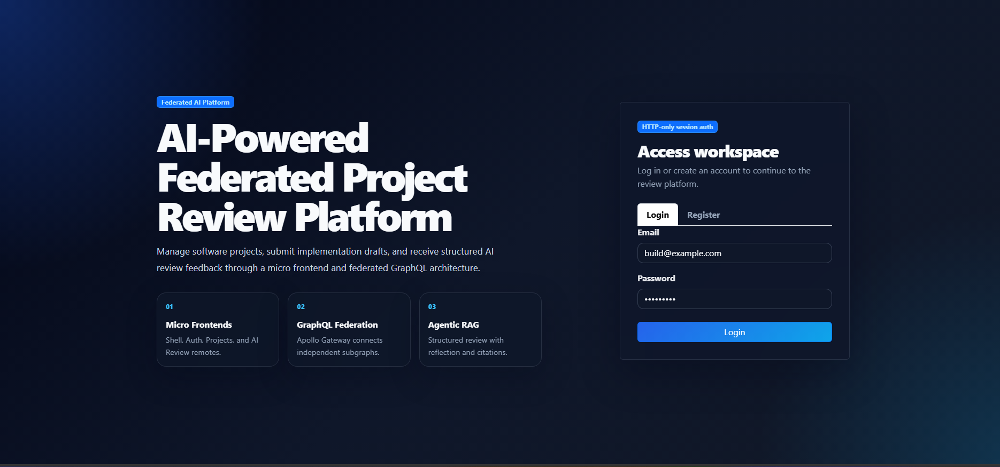
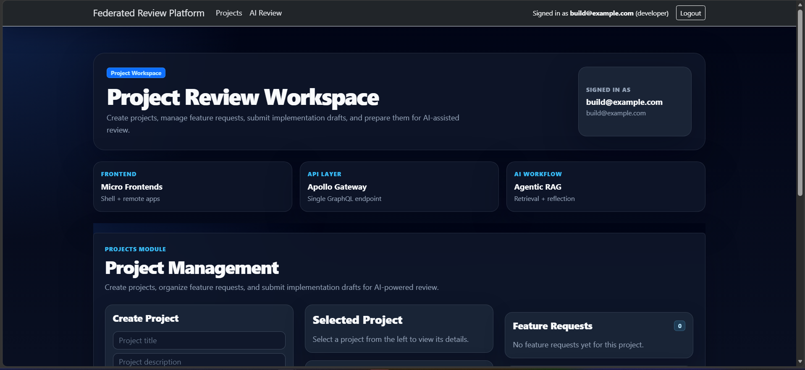
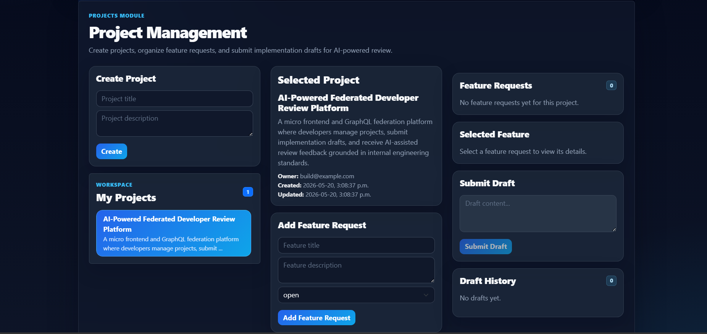
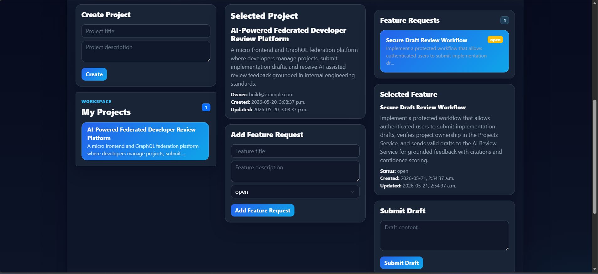
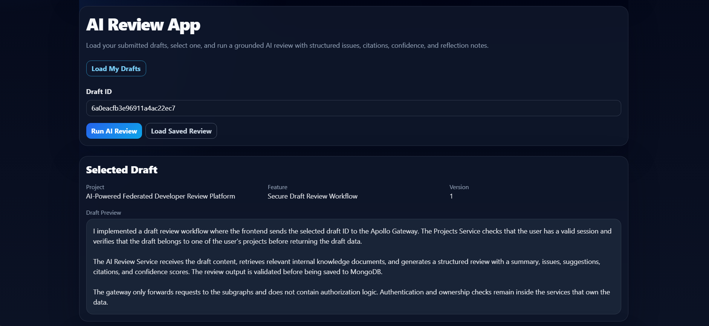
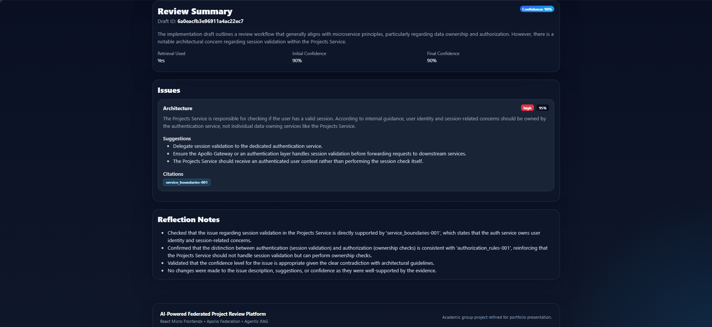

# AI-Powered Federated Project Review Platform

A micro frontend and GraphQL federation platform for managing software projects, submitting implementation drafts, and receiving AI-powered structured review feedback.

## Overview

**AI-Powered Federated Project Review Platform** is a full-stack developer collaboration system built with React micro frontends, Apollo GraphQL Federation, MongoDB, and an AI-powered review service.

The application allows users to register, log in, create projects, add feature requests, submit implementation drafts, and receive AI-assisted feedback on their drafts. The frontend is split into modular micro frontend applications, while the backend uses an Apollo Gateway to combine multiple GraphQL subgraphs into one unified API.

The AI Review service uses a retrieval-augmented generation workflow to analyze submitted drafts and return structured feedback, including summaries, issues, suggestions, confidence levels, reflection notes, and citations.

This project was originally developed as an academic group project for COMP308 Emerging Technologies and later refined as a portfolio project to demonstrate modern frontend architecture, federated GraphQL backend design, session-based authentication, and practical AI integration.

## Group

Group-4

## Team Members

- Carson Stewart
- Davi Mar
- Justine Aldea
- Percy Osunde
- Trizha Bacani

## My Contributions

This project was originally developed as an academic group project for COMP308 Emerging Technologies. My main contributions focused on the frontend architecture, micro frontend integration, and the AI-powered review functionality.

My primary ownership areas included:

- Built the frontend experience using React and Vite-based micro frontends.
- Worked on the Shell application integration, including loading remote frontend applications.
- Implemented the main Projects UI flow for creating projects, adding feature requests, selecting features, and submitting drafts.
- Integrated frontend communication with the Apollo GraphQL Gateway.
- Contributed heavily to the AI Review functionality, including the AI/RAG review workflow and structured review output.
- Helped connect the project workflow to the AI review process so submitted drafts could be reviewed and returned with feedback, confidence levels, issues, suggestions, and citations.
- Participated in debugging authentication/session behavior across the Gateway and subgraphs.

Although this was a team project, my strongest ownership areas were the frontend implementation and a major portion of the AI review feature.

---

## Project Structure

### Client: Micro Frontends

- **shell-app** — Host application responsible for global layout, routing, authentication state, and loading remote micro frontends.
- **auth-app** — Remote micro frontend for user registration and login.
- **projects-app** — Remote micro frontend for managing projects, feature requests, and draft submissions.
- **ai-review-app** — Remote micro frontend for requesting and displaying AI-powered draft reviews.

### Server: GraphQL Microservices

- **gateway.js** — Apollo Gateway that exposes a single GraphQL endpoint and routes requests to the subgraphs.
- **auth-service** — Handles user registration, login, logout, current user lookup, and session management.
- **projects-service** — Manages projects, feature requests, implementation drafts, and ownership-based authorization.
- **ai-review-service** — Performs AI-powered draft review using retrieval, structured output, reflection, confidence scoring, and citations.

---

## Tech Stack

- **Frontend:** React, Vite, Module Federation, React Bootstrap
- **Backend:** Node.js, Express
- **API Layer:** GraphQL, Apollo Client, Apollo Gateway, Apollo Federation
- **Database:** MongoDB, Mongoose
- **Authentication:** Session-based authentication with HTTP-only cookies
- **AI/RAG:** Gemini API, LangChain.js, LangGraph.js, FAISS vector store, Zod validation

---

## Architecture Overview

The platform follows a micro frontend and federated GraphQL architecture. The frontend is divided into independent React applications, while the backend is divided into GraphQL subgraphs that are composed through a single Apollo Gateway.

```text
User
  |
  v
Shell App (Host Micro Frontend)
  |
  |-- loads Auth App remote
  |-- loads Projects App remote
  |-- loads AI Review App remote
  |
  v
Apollo Client
  |
  v
Apollo Gateway (/graphql)
  |
  |-- Auth Service
  |     |-- registration
  |     |-- login/logout
  |     |-- currentUser
  |     |-- session management
  |
  |-- Projects Service
  |     |-- projects
  |     |-- feature requests
  |     |-- implementation drafts
  |     |-- ownership-based authorization
  |
  |-- AI Review Service
        |-- draft review
        |-- retrieval-augmented generation
        |-- structured AI output
        |-- reflection
        |-- citations and confidence scoring
```

### Frontend Architecture

The Shell application acts as the host application. It is responsible for the main layout, navigation, authentication-aware rendering, and loading remote micro frontends.

The Auth App provides the registration and login interface. The Projects App provides the project workflow, including project creation, feature request management, and draft submission. The AI Review App provides the interface for requesting and viewing AI-generated review feedback.

This separation allows each frontend area to remain modular while still behaving like one connected application from the user's perspective.

### Backend Architecture

The backend uses Apollo Gateway as the single GraphQL entry point. The gateway composes multiple GraphQL subgraphs into one unified API.

The Auth Service owns user authentication and session management. The Projects Service owns project-related data and authorization checks. The AI Review Service owns the AI/RAG review workflow.

The gateway remains focused on request routing and schema composition. Authorization logic stays inside the appropriate backend services.

### Authentication Flow

The platform uses session-based authentication with HTTP-only cookies. After login, the backend creates a session and sends the session cookie to the browser. The browser stores the cookie automatically and sends it with later requests.

The Apollo Gateway forwards incoming cookies to the subgraphs and forwards `Set-Cookie` headers back to the client. This allows authentication to work correctly across the federated GraphQL architecture.

### AI Review Flow

The AI Review Service reviews implementation drafts using an Agentic RAG workflow:

1. A user submits a draft through the Projects workflow.
2. The AI Review Service retrieves relevant internal knowledge documents.
3. The AI model generates structured review feedback.
4. A reflection step checks the review for unsupported claims or weak reasoning.
5. The service returns a final review with summary, issues, suggestions, confidence scores, reflection notes, and citations.

This design treats AI output as probabilistic and validates the response structure before returning it to the frontend.

---

## Key Features

- **Session-Based Authentication**
  - User registration, login, logout, and current user lookup.
  - Authentication is handled through server-side sessions and HTTP-only cookies.

- **Micro Frontend Architecture**
  - Shell application loads remote frontend applications.
  - Projects and AI Review features are separated into independent React/Vite micro frontends.

- **Federated GraphQL Backend**
  - Apollo Gateway exposes a single `/graphql` endpoint.
  - Auth, Projects, and AI Review services are separated into individual GraphQL subgraphs.

- **Project and Feature Management**
  - Users can create projects.
  - Users can add feature requests to projects.
  - Users can submit implementation drafts for review.
  - Draft history can be viewed by feature request.

- **AI-Powered Draft Review**
  - Submitted drafts can be reviewed by the AI Review Service.
  - The review output includes summaries, issues, suggestions, confidence scores, reflection notes, and citations.

- **Agentic RAG Workflow**
  - Internal knowledge documents are embedded and retrieved during review.
  - The AI model generates structured feedback.
  - A reflection step checks the review for unsupported claims and adjusts confidence.

- **MongoDB Data Persistence**
  - MongoDB is used for users, sessions, projects, feature requests, drafts, and AI review results.

- **Structured AI Output Validation**
  - AI responses are validated before being returned to the frontend.
  - The system treats AI output as probabilistic instead of blindly trusting model responses.

---

## Screenshots

### Authentication Page



### Projects Dashboard



### Selected Project View



### Draft Submission Workflow



### Draft History Workflow


### AI Review Page



### AI Review Result



---

## Demo Workflow

A typical user workflow in the application is:

1. Register a new user account or log in with an existing account.
2. Create a new software project.
3. Add a feature request to the selected project.
4. Select the feature request and submit an implementation draft.
5. Open the AI Review section.
6. Request an AI-powered review for the submitted draft.
7. Review the structured AI feedback, including:
   - Summary
   - Issues
   - Suggestions
   - Confidence scores
   - Reflection notes
   - Citations

This workflow demonstrates the full system interaction between the micro frontend applications, Apollo Gateway, GraphQL subgraphs, MongoDB persistence, and the AI/RAG review service.

---

## Requirements Alignment

This project was built to satisfy the COMP308 Emerging Technologies group project requirements for a modern AI-augmented developer platform.
| Requirement | Implementation |
|---|---|
| Micro Frontends | Implemented the required Shell App, Projects App remote, and AI Review App remote using React, Vite, and Module Federation, with an additional Auth App remote for registration and login UI. |
| Apollo Gateway | Implemented a single GraphQL entry point through Apollo Gateway. |
| GraphQL Subgraphs | Implemented Auth Service, Projects Service, and AI Review Service as separate GraphQL services. |
| Session-Based Authentication | Used server-side sessions with HTTP-only cookies instead of JWT/localStorage authentication. |
| Cookie Forwarding | Gateway forwards incoming cookies to subgraphs and forwards `Set-Cookie` headers back to the browser. |
| Projects Workflow | Users can create projects, add feature requests, submit drafts, and view draft history. |
| Authorization | Project ownership and protected actions are enforced inside the Projects Service. |
| Agentic RAG | AI Review Service retrieves internal knowledge, generates structured feedback, performs reflection, and returns citations. |
| Structured AI Output | AI output is validated before being returned to the frontend. |
| MongoDB Modeling | MongoDB stores users, sessions, projects, feature requests, drafts, and AI review results. |

---

## Getting Started

### Prerequisites

Before running the project, make sure you have:

- Node.js installed
- npm installed
- MongoDB running locally or a MongoDB Atlas connection string
- A Gemini API key for the AI Review Service

### Environment Variables

Each backend service requires environment variables for local development.

Common variables include:

```env
MONGO_URI=your_mongodb_connection_string
SESSION_SECRET=your_session_secret
GOOGLE_API_KEY=your_gemini_api_key
```

The AI Review Service requires `GOOGLE_API_KEY` to generate embeddings and AI review responses.

### Install Dependencies

Install dependencies for each backend service and frontend app.

```bash
# Auth Service
cd server/microservices/auth-service
npm install
```

```bash
# Projects Service
cd server/microservices/projects-service
npm install
```

```bash
# AI Review Service
cd server/microservices/ai-review-service
npm install
```

```bash
# Apollo Gateway
cd server
npm install
```

```bash
# Auth Remote
cd react-MFEs/auth-app
npm install
```

```bash
# Projects Remote
cd react-MFEs/projects-app
npm install
```

```bash
# AI Review Remote
cd react-MFEs/ai-review-app
npm install
```

```bash
# Shell Host
cd react-MFEs/shell-app
npm install
```

### Run the Backend Services

Start each backend service in a separate terminal.

```bash
# Auth Service
cd server/microservices/auth-service
npm run dev
```

```bash
# Projects Service
cd server/microservices/projects-service
npm run dev
```

```bash
# AI Review Service
cd server/microservices/ai-review-service
npm run dev
```

```bash
# Apollo Gateway
cd server
npm run dev
```

### Run the Frontend Apps

The remote micro frontends should be built first and then served using Vite preview. Start each remote in a separate terminal.

```bash
# Auth Remote
cd react-MFEs/auth-app
npm run build
npm run preview
```

```bash
# Projects Remote
cd react-MFEs/projects-app
npm run build
npm run preview
```

```bash
# AI Review Remote
cd react-MFEs/ai-review-app
npm run build
npm run preview
```

```bash
# Shell Host
cd react-MFEs/shell-app
npm run dev
```

After all services are running, open the Shell App in the browser and use the demo workflow described above.

### Notes

- The Apollo Gateway runs as the single GraphQL entry point.
- The frontend should send requests through the gateway.
- Cookies must be enabled in the browser for session-based authentication to work.
- The AI Review Service requires the vector store/index and Gemini API key before AI review requests can run successfully.

---

## Future Improvements

- Improve the visual design of the frontend dashboard and AI review screens.
- Add a Docker Compose setup to run the gateway, subgraphs, frontend apps, and MongoDB with one command.
- Deploy the frontend and backend services to a cloud platform.
- Add CI/CD checks for linting, tests, and build validation.
- Add automated tests for GraphQL resolvers and authentication flows.
- Add admin/developer role-based permissions.
- Add AI review history analytics and confidence trend tracking.
